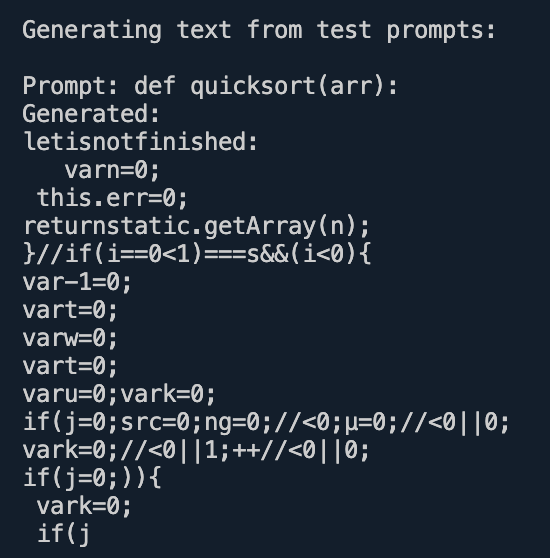

# codellm

This project is adapted from [lit-llama](https://github.com/Lightning-AI/lit-llama) to pre-train a code LLM for educational purposes.

### Dataset

The model is trained on the [RedPajama-Data-1T-Sample](https://huggingface.co/datasets/togethercomputer/RedPajama-Data-1T-Sample) dataset, which provides a diverse collection of code and text data. The data preparation process involves two steps:

1. First, `prepare_redpajama.py` processes the raw data into a tokenized format called **redpajama_sample**
2. Then, `split_data.py` divides this processed data into **redpajama_train** and **redpajama_val** sets for training and validation

### Tokenizer

I use the tokenizer from Code Llama

```python
from transformers import LlamaTokenizer

tokenizer = LlamaTokenizer.from_pretrained("codellama/CodeLlama-7b-hf")
tokenizer.save_pretrained("checkpoints/tokenizer")
```

### Progress

**02-17-2025**: Completed initial training of the model for 100,000 iterations on Apple M2 hardware. The model shows basic understanding of code structure but needs improvement in code completion quality. Here's a sample output from the model:


